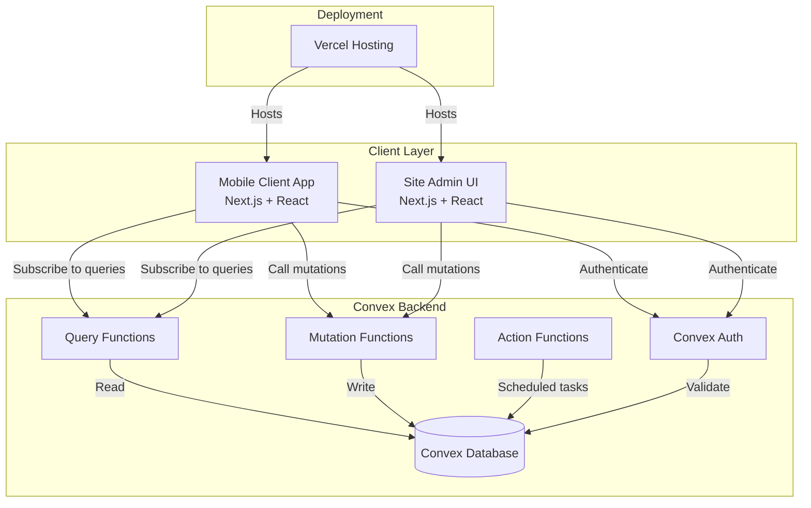
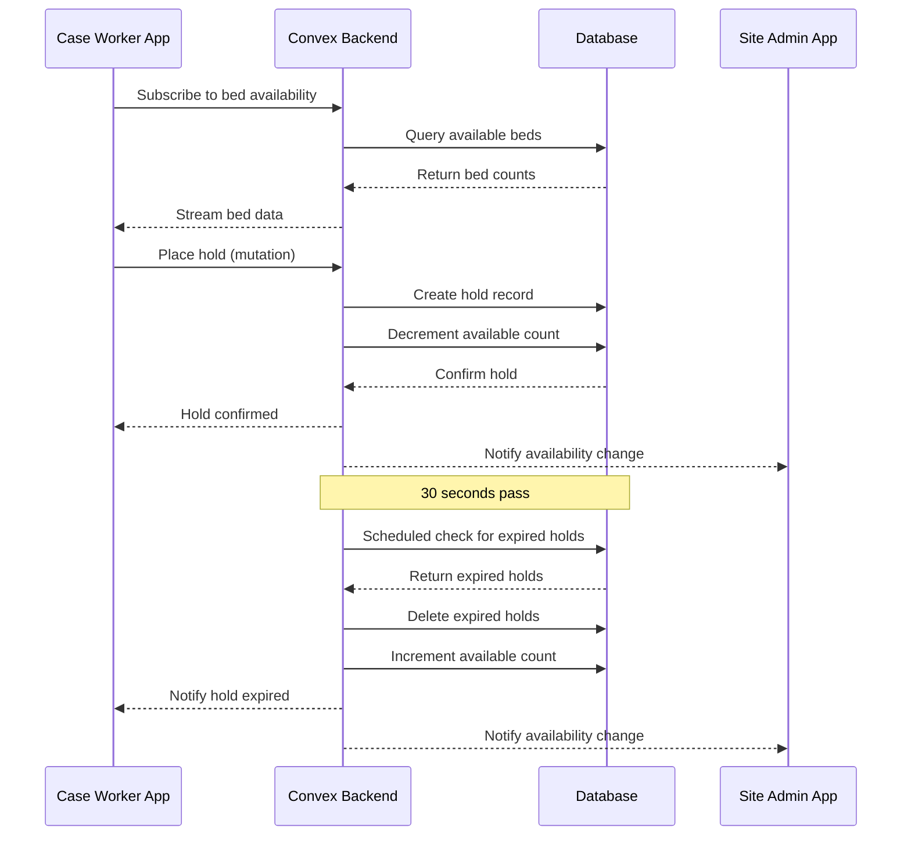
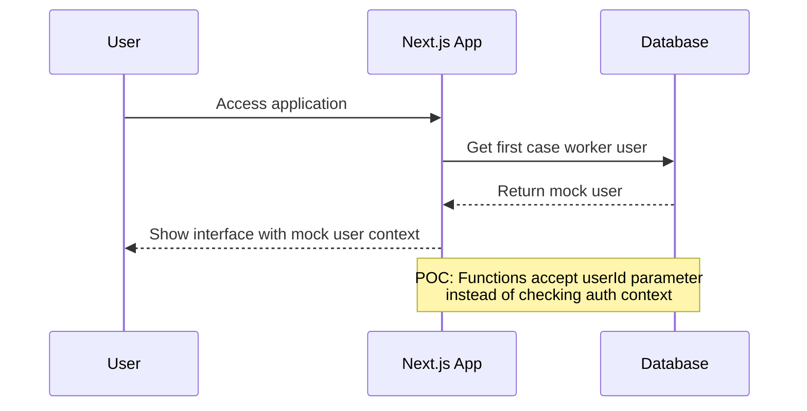
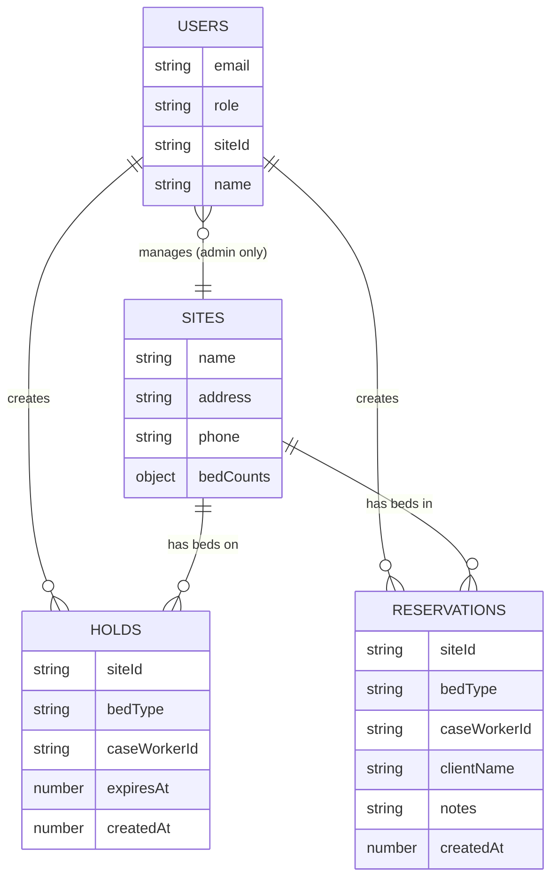

# Design Document

## Overview

The Bed Reservation System is a real-time web application built with Next.js 15.5, React 19, and Convex that enables case workers to reserve beds across multiple provider sites while site administrators manage their bed inventory. The system leverages Convex's real-time database capabilities to ensure all users see synchronized bed availability within 2 seconds of any change.

The application consists of two primary user interfaces:
- **Mobile Client App**: A mobile-optimized interface for case workers to view availability and reserve beds
- **Site Admin UI**: A desktop-friendly interface for site administrators to manage bed inventory and reservations

### Key Design Principles

1. **Real-time First**: All state changes propagate immediately through Convex subscriptions
2. **Mobile-Optimized**: Touch-friendly UI with responsive design for small screens
3. **Minimal Friction**: Streamlined reservation flow with multiple entry points
4. **Temporary Holds**: Prevent double-booking while allowing holds to expire automatically
5. **Role-Based Access**: Clear separation between case worker and admin capabilities

## Architecture

### System Architecture



### Technology Stack

- **Frontend Framework**: Next.js 15.5 with App Router
- **UI Library**: React 19
- **Styling**: Tailwind CSS v4
- **Component Library**: Shadcn UI
- **Backend & Database**: Convex (real-time database with built-in functions)
- **Authentication**: POC - Simplified (no authentication for demo purposes)
- **Deployment**: Vercel
- **Language**: TypeScript

### Application Structure

```
bed-reservation-system/
├── app/
│   ├── (case-worker)/          # Case worker routes
│   │   ├── layout.tsx          # Case worker layout with auth
│   │   ├── page.tsx            # Main availability dashboard
│   │   ├── bed-type/
│   │   │   └── [type]/
│   │   │       └── page.tsx    # Bed type detail view
│   │   └── reserve/
│   │       └── page.tsx        # Reservation flow
│   ├── (admin)/                # Site admin routes
│   │   ├── layout.tsx          # Admin layout with auth
│   │   ├── page.tsx            # Admin dashboard
│   │   └── site/
│   │       └── [siteId]/
│   │           └── page.tsx    # Site management
│   └── api/
│       └── auth/               # Auth endpoints
├── components/
│   ├── ui/                     # Shadcn components
│   ├── case-worker/            # Case worker specific components
│   └── admin/                  # Admin specific components
├── convex/
│   ├── schema.ts               # Database schema
│   ├── sites.ts                # Site queries and mutations
│   ├── beds.ts                 # Bed availability queries
│   ├── holds.ts                # Hold management
│   ├── reservations.ts         # Reservation management
│   ├── users.ts                # User queries (POC)
│   └── _generated/             # Convex generated files
├── lib/
│   ├── convex.ts               # Convex client setup
│   └── utils.ts                # Utility functions
└── types/
    └── index.ts                # Shared TypeScript types
```

## Components and Interfaces

### Data Flow Architecture



### Frontend Components

#### Mobile Client App Components

**AvailabilityDashboard** (`app/(case-worker)/page.tsx`)
- Displays total available beds by type across all sites
- Real-time subscription to bed availability
- Navigation to bed type details or reservation flow
- Props: None (uses Convex queries)

**BedTypeDetail** (`app/(case-worker)/bed-type/[type]/page.tsx`)
- Shows availability breakdown by site for a specific bed type
- Lists site information (name, address, phone)
- Allows tapping a site to start reservation with pre-selection
- Props: `bedType: BedType`

**ReservationFlow** (`app/(case-worker)/reserve/page.tsx`)
- Multi-step form for completing reservation
- Steps: Select bed type → Select site → Enter client info
- Manages hold state and expiration notifications
- Props: `preselectedBedType?: BedType`, `preselectedSiteId?: string`

**HoldTimer** (`components/case-worker/HoldTimer.tsx`)
- Displays countdown for active hold
- Shows notification when hold expires
- Provides refresh button
- Props: `holdExpiresAt: number`, `onRefresh: () => void`, `onExpire: () => void`

**BedTypeCard** (`components/case-worker/BedTypeCard.tsx`)
- Displays bed type icon and available count
- Touchable card for navigation
- Props: `bedType: BedType`, `availableCount: number`, `onClick: () => void`

**SiteCard** (`components/case-worker/SiteCard.tsx`)
- Displays site information and available beds
- Touchable card for site selection
- Props: `site: Site`, `availableCount: number`, `onClick: () => void`

#### Site Admin UI Components

**AdminDashboard** (`app/(admin)/page.tsx`)
- Overview of site's bed inventory
- Quick stats on holds and reservations
- Navigation to detailed management
- Props: None (uses Convex queries with site context)

**BedInventoryManager** (`components/admin/BedInventoryManager.tsx`)
- Editable bed counts for each type
- Shows available, on hold, and reserved counts
- Real-time updates
- Props: `siteId: string`

**ReservationList** (`components/admin/ReservationList.tsx`)
- Table of active reservations
- Shows client name, notes, bed type, case worker, timestamp
- Release button for each reservation
- Props: `siteId: string`

**SiteInfoEditor** (`components/admin/SiteInfoEditor.tsx`)
- Form for editing site name, address, phone
- Auto-save on blur
- Props: `siteId: string`

### Backend Components (Convex Functions)

#### Schema (`convex/schema.ts`)

```typescript
// User roles
enum Role {
  CASE_WORKER = "case_worker",
  SITE_ADMIN = "site_admin"
}

// Bed types
enum BedType {
  APPLE = "apple",
  ORANGE = "orange",
  LEMON = "lemon",
  GRAPE = "grape"
}

// Users table
users: {
  email: string
  role: Role
  siteId?: string  // Only for site admins
  name: string
}

// Sites table
sites: {
  name: string
  address: string
  phone: string
  bedCounts: {
    apple: number
    orange: number
    lemon: number
    grape: number
  }
}

// Holds table
holds: {
  siteId: Id<"sites">
  bedType: BedType
  caseWorkerId: Id<"users">
  expiresAt: number  // Unix timestamp
  createdAt: number
}

// Reservations table
reservations: {
  siteId: Id<"sites">
  bedType: BedType
  caseWorkerId: Id<"users">
  clientName: string
  notes: string
  createdAt: number
}
```

#### Query Functions

**`getBedAvailability`** (`convex/beds.ts`)
- Returns total available beds by type across all sites
- Calculates: total beds - holds - reservations
- Real-time subscription for case workers
- Returns: `{ [bedType]: number }`

**`getBedAvailabilityByType`** (`convex/beds.ts`)
- Returns availability breakdown by site for a specific bed type
- Includes site information
- Returns: `Array<{ site: Site, availableCount: number }>`

**`getSiteInventory`** (`convex/sites.ts`)
- Returns bed inventory for a specific site
- Includes total, available, on hold, and reserved counts
- Returns: `{ [bedType]: { total, available, onHold, reserved } }`

**`getReservations`** (`convex/reservations.ts`)
- Returns all active reservations for a site
- Includes case worker info and client details
- Returns: `Array<Reservation & { caseWorkerName: string }>`

**`getActiveHold`** (`convex/holds.ts`)
- Returns active hold for a user
- POC: Accepts `userId` parameter
- Returns: `Hold | null`

#### Mutation Functions

**`placeHold`** (`convex/holds.ts`)
- Creates a hold on a bed
- Validates bed availability
- Sets expiration to 30 seconds from now
- POC: Accepts `userId` parameter
- Returns: `{ success: boolean, data?: Id<"holds">, error?: string, code?: ErrorCode }`

**`refreshHold`** (`convex/holds.ts`)
- Extends an existing hold by 30 seconds
- Validates bed still available
- POC: Accepts `userId` parameter
- Returns: `{ success: boolean, error?: string, code?: ErrorCode }`

**`releaseHold`** (`convex/holds.ts`)
- Removes a hold (manual cancellation)
- POC: Accepts `userId` parameter
- Returns: `{ success: boolean }`

**`createReservation`** (`convex/reservations.ts`)
- Converts hold to reservation
- Validates hold exists and hasn't expired
- Stores client information
- Removes the hold
- POC: Accepts `userId` parameter
- Returns: `{ success: boolean, data?: Id<"reservations">, error?: string, code?: ErrorCode }`

**`releaseReservation`** (`convex/reservations.ts`)
- Removes a reservation
- Increments available bed count
- POC: No auth checks
- Returns: `{ success: boolean }`

**`updateBedCounts`** (`convex/sites.ts`)
- Updates bed inventory for a site
- Validates counts are non-negative
- POC: No auth checks
- Returns: `{ success: boolean, error?: string, code?: ErrorCode }`

**`updateSiteInfo`** (`convex/sites.ts`)
- Updates site name, address, phone
- POC: No auth checks
- Returns: `{ success: boolean }`

#### Cleanup Functions

**`cleanupExpiredHolds`** (`convex/holds.ts`)
- Mutation to cleanup expired holds
- Finds holds where `expiresAt < Date.now()`
- Deletes expired holds
- POC: Can be called manually (scheduled cron disabled for simplicity)
- Returns: `{ deletedCount: number }`

### Authentication Flow (POC - Simplified)

**Note**: For POC purposes, authentication has been simplified. In production, this would use Convex Auth or similar.



**POC Implementation**:
- No login required
- Functions accept `userId` as a parameter
- Frontend passes hardcoded user ID from seeded data
- No authorization checks in backend functions
- Suitable for demo and development only

## Data Models

### Core Entities

#### User
```typescript
interface User {
  _id: Id<"users">
  email: string
  role: "case_worker" | "site_admin"
  siteId?: Id<"sites">  // Required for site_admin, null for case_worker
  name: string
  _creationTime: number
}
```

#### Site
```typescript
interface Site {
  _id: Id<"sites">
  name: string
  address: string
  phone: string
  bedCounts: {
    apple: number
    orange: number
    lemon: number
    grape: number
  }
  _creationTime: number
}
```

#### Hold
```typescript
interface Hold {
  _id: Id<"holds">
  siteId: Id<"sites">
  bedType: "apple" | "orange" | "lemon" | "grape"
  caseWorkerId: Id<"users">
  expiresAt: number  // Unix timestamp (ms)
  createdAt: number  // Unix timestamp (ms)
  _creationTime: number
}
```

#### Reservation
```typescript
interface Reservation {
  _id: Id<"reservations">
  siteId: Id<"sites">
  bedType: "apple" | "orange" | "lemon" | "grape"
  caseWorkerId: Id<"users">
  clientName: string
  notes: string
  createdAt: number  // Unix timestamp (ms)
  _creationTime: number
}
```

### Derived Data Models

#### BedAvailability (computed)
```typescript
interface BedAvailability {
  bedType: "apple" | "orange" | "lemon" | "grape"
  totalAvailable: number  // Sum across all sites
}
```

#### SiteBedAvailability (computed)
```typescript
interface SiteBedAvailability {
  site: Site
  bedType: "apple" | "orange" | "lemon" | "grape"
  total: number
  available: number  // total - holds - reservations
  onHold: number
  reserved: number
}
```

### Data Relationships



## Error Handling

### Error Categories

1. **Validation Errors**: Invalid input data (e.g., negative bed counts, missing required fields)
2. **Authorization Errors**: User attempting unauthorized action (e.g., case worker trying to release reservation)
3. **Concurrency Errors**: Race conditions (e.g., two users trying to reserve the last bed)
4. **Expiration Errors**: Hold expired before reservation completed
5. **Network Errors**: Connection issues with Convex backend

### Error Handling Strategy

#### Frontend Error Handling

**Toast Notifications**
- Use Shadcn toast component for user-facing errors
- Display clear, actionable error messages
- Auto-dismiss after 5 seconds for non-critical errors
- Require manual dismissal for critical errors

**Form Validation**
- Client-side validation before submission
- Real-time validation feedback
- Disable submit buttons until valid

**Loading States**
- Show loading indicators during async operations
- Disable interactive elements during mutations
- Optimistic updates where appropriate

**Error Recovery**
- Automatic retry for network errors (max 3 attempts)
- Clear path to retry failed operations
- Graceful degradation when real-time updates fail

#### Backend Error Handling

**Mutation Error Responses**
```typescript
type MutationResult<T> = 
  | { success: true; data: T }
  | { success: false; error: string; code: ErrorCode }

enum ErrorCode {
  VALIDATION_ERROR = "validation_error",
  AUTHORIZATION_ERROR = "authorization_error",
  NOT_FOUND = "not_found",
  CONFLICT = "conflict",
  EXPIRED = "expired"
}
```

**Specific Error Scenarios**

1. **Hold Placement Fails (No Beds Available)**
   - Return: `{ success: false, error: "No beds of type [type] available at [site]", code: "conflict" }`
   - Frontend: Show toast, suggest alternative sites or bed types

2. **Hold Expired During Reservation**
   - Return: `{ success: false, error: "Hold expired. Please start a new reservation.", code: "expired" }`
   - Frontend: Show modal with option to start new reservation

3. **Concurrent Reservation Attempt**
   - Use Convex's transactional guarantees
   - Check availability within mutation
   - Return conflict error if bed taken

4. **Unauthorized Action**
   - Return: `{ success: false, error: "You don't have permission to perform this action", code: "authorization_error" }`
   - Frontend: Show error and redirect to appropriate interface

5. **Invalid Bed Count Update**
   - Validate: count >= (holds + reservations)
   - Return: `{ success: false, error: "Cannot set bed count below current holds and reservations", code: "validation_error" }`
   - Frontend: Show error with current hold/reservation counts

### Real-Time Sync Error Handling

**Connection Loss**
- Convex client automatically reconnects
- Show connection status indicator
- Queue mutations during offline period
- Sync when connection restored

**Stale Data Detection**
- Convex handles this automatically through subscriptions
- No manual staleness checks needed

## Testing Strategy

### Unit Testing

**Frontend Components**
- Test framework: Vitest + React Testing Library
- Focus areas:
  - Component rendering with various props
  - User interactions (clicks, form inputs)
  - Conditional rendering based on state
  - Error state display

**Convex Functions**
- Test framework: Convex test helpers
- Focus areas:
  - Query return values with various data states
  - Mutation success/failure paths
  - Authorization checks
  - Data validation

### Integration Testing

**Reservation Flow**
- Test complete flow from availability view to confirmed reservation
- Verify hold creation, expiration, and conversion
- Test cancellation at various stages

**Real-Time Updates**
- Simulate multiple clients
- Verify updates propagate within 2 seconds
- Test hold expiration notifications

**Admin Operations**
- Test bed count updates reflect in case worker views
- Test reservation release updates availability
- Verify authorization boundaries

### End-to-End Testing

**Framework**: Playwright

**Critical User Journeys**
1. Case worker logs in → views availability → reserves bed → completes reservation
2. Case worker starts reservation → hold expires → refreshes hold → completes
3. Site admin logs in → updates bed counts → releases reservation
4. Multiple case workers compete for last bed (concurrency test)

**Cross-Browser Testing**
- Chrome (primary)
- Safari (iOS)
- Firefox

**Mobile Device Testing**
- iPhone SE (small screen)
- iPhone 14 Pro (standard)
- iPad (tablet)

### Performance Testing

**Metrics to Monitor**
- Time to interactive (TTI) < 3 seconds
- Real-time update latency < 2 seconds
- Mutation response time < 500ms
- Hold expiration accuracy ± 1 second

**Load Testing**
- Simulate 50 concurrent case workers
- Simulate 10 concurrent reservations
- Verify no race conditions or data corruption

### Manual Testing Checklist

**Mobile Usability**
- [ ] All touch targets are at least 44x44 pixels
- [ ] Text is readable without zooming
- [ ] Forms are easy to complete on mobile keyboard
- [ ] No horizontal scrolling required

**Accessibility**
- [ ] Keyboard navigation works throughout
- [ ] Screen reader announces important state changes
- [ ] Color contrast meets WCAG AA standards
- [ ] Focus indicators are visible

**Real-Time Behavior**
- [ ] Updates appear within 2 seconds across devices
- [ ] Hold timer counts down accurately
- [ ] Expiration notification appears promptly
- [ ] No phantom beds (availability matches reality)

## Implementation Notes

### Convex Setup

1. **Initialize Convex project**
   ```bash
   npx convex dev
   ```

2. **POC Authentication**
   - No authentication configured
   - Functions accept userId parameters
   - Suitable for demo purposes only

3. **Scheduled Functions (POC)**
   - `cleanupExpiredHolds` available as mutation
   - Can be called manually for testing
   - Scheduled cron disabled for simplicity

### Next.js Configuration

1. **App Router Structure**
   - Use route groups for role-based layouts: `(case-worker)` and `(admin)`
   - Implement middleware for authentication checks
   - Configure Convex provider at root layout

2. **Environment Variables**
   ```
   CONVEX_DEPLOYMENT=<deployment-url>
   NEXT_PUBLIC_CONVEX_URL=<public-url>
   ```

### Tailwind & Shadcn Setup

1. **Install Tailwind v4**
   ```bash
   npm install tailwindcss@next @tailwindcss/postcss@next
   ```

2. **Initialize Shadcn**
   ```bash
   npx shadcn@latest init
   ```

3. **Install Required Components**
   - Button, Card, Input, Label, Toast, Dialog, Select, Textarea

### Mobile Optimization

1. **Viewport Configuration**
   ```html
   <meta name="viewport" content="width=device-width, initial-scale=1, maximum-scale=1">
   ```

2. **Touch Optimization**
   - Use `touch-action` CSS property
   - Implement touch feedback with Tailwind active states
   - Ensure 44px minimum touch targets

3. **Performance**
   - Lazy load non-critical components
   - Optimize images with Next.js Image component
   - Use React.memo for expensive components

### Deployment to Vercel

1. **Connect Repository**
   - Link GitHub repository to Vercel project

2. **Configure Environment Variables**
   - Add Convex deployment URL
   - Configure production environment

3. **Build Settings**
   - Framework: Next.js
   - Build command: `npm run build`
   - Output directory: `.next`

4. **Deploy**
   - Automatic deployments on push to main branch
   - Preview deployments for pull requests

### Development Workflow

1. **Local Development**
   ```bash
   # Terminal 1: Run Convex dev server
   npx convex dev
   
   # Terminal 2: Run Next.js dev server
   npm run dev
   ```

2. **Database Seeding**
   - Create seed script to populate initial sites
   - Add sample users for testing

3. **Testing During Development**
   - Use multiple browser windows to simulate multiple users
   - Test real-time updates across windows
   - Verify hold expiration with 30-second timer
